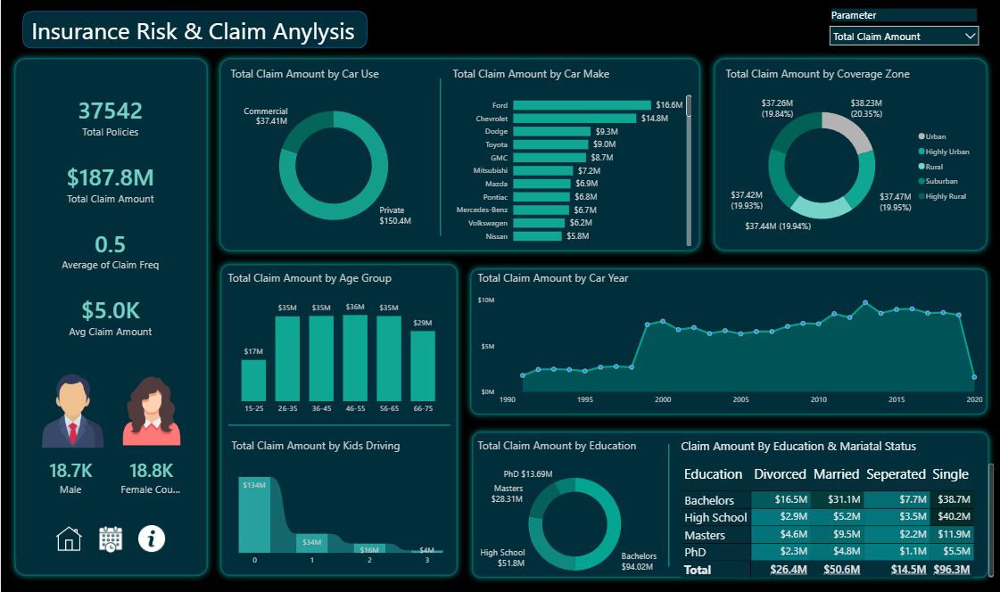

# Insurance Risk & Claim Analysis

An interactive Power BI dashboard designed to analyze insurance claims, policy distribution, and claim patterns across multiple business dimensions.

## 📊 Dashboard Preview



---

## 🎯 Project Objective

The objective of this project is to analyze insurance policy and claim data and transform it into an interactive dashboard that helps identify claim patterns across customer demographics, vehicle characteristics, coverage zones, and policy attributes.

The dashboard provides a consolidated view of key insurance metrics and enables users to explore claim trends through interactive analysis.

---

## 🔍 Key Metrics

- **37,542** Total Policies
- **$187.8M** Total Claim Amount
- **0.5** Average Claim Frequency
- **$5.0K** Average Claim Amount
- **18.7K** Male Customers
- **18.8K** Female Customers

---

## 📈 Dashboard Analysis

The dashboard analyzes total claim amounts across several dimensions:

- Claim Amount by **Car Use**
- Claim Amount by **Car Make**
- Claim Amount by **Coverage Zone**
- Claim Amount by **Age Group**
- Claim Amount by **Car Year**
- Claim Amount by **Kids Driving**
- Claim Amount by **Education**
- Claim Amount by **Education & Marital Status**

An interactive parameter is also included to allow users to change the metric being analyzed.

---

## 🛠️ Tools & Technologies

- **Power BI Desktop**
- **Power Query**
- **DAX**
- **Data Modeling**
- **Interactive Data Visualization**

---

## 🧹 Data Preparation

The data was prepared and transformed using Power Query before being used for analysis and visualization.

Key activities included:

- Data cleaning and transformation
- Data type standardization
- Preparing fields for analysis
- Creating calculated metrics
- Structuring data for dashboard reporting

---

## 📐 Data Analysis

DAX measures were used to create key business metrics and support interactive analysis.

The dashboard combines KPI cards, charts, slicer/parameter-driven analysis, and tabular reporting to provide a consolidated view of insurance claim performance.

---

## 💡 Business Questions

This dashboard helps answer questions such as:

1. What is the total value of insurance claims?
2. Which car makes contribute the highest claim amounts?
3. How do claims vary across different coverage zones?
4. Which age groups generate the highest claim amounts?
5. How have claim amounts changed across car years?
6. How does claim value differ by car usage?
7. What relationship exists between education and marital status in relation to claim amounts?
8. How does claim amount vary based on whether customers have kids driving?

---

## 📁 Repository Structure

```text
Insurance-Risk-Claim-Analysis/
│
├── Power BI/
│   └── Insurance Claims Analysis Report.pbix
│
├── Screenshots/
│   └── Insurance-Risk-Claim-Analysis.png
│
└── README.md
